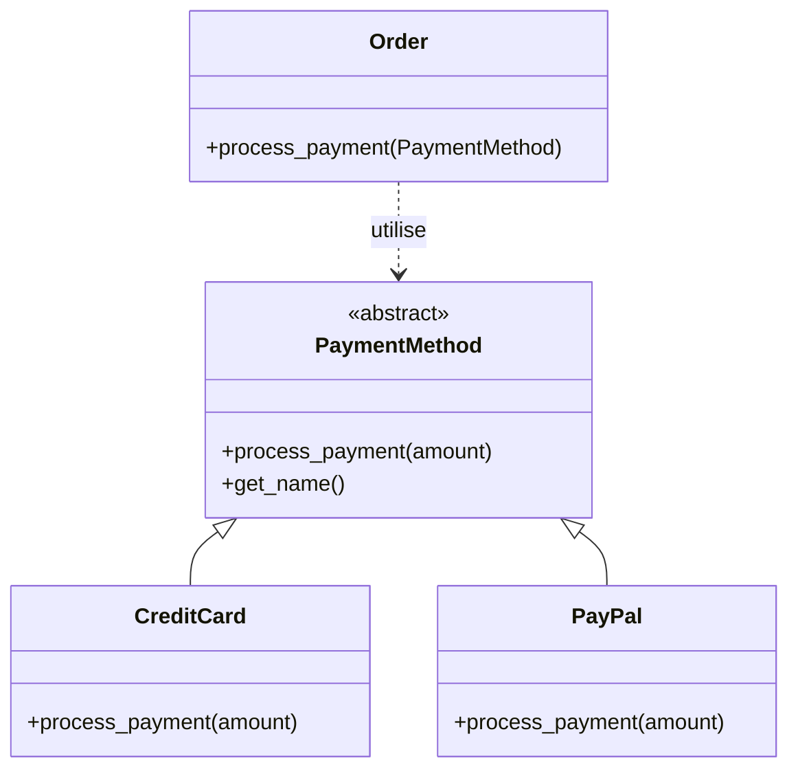

# Constats : Polymorphisme dans un Système de Paiement (Héritage 2)

Cet exemple montre une application concrète du polymorphisme dans un système de commerce électronique complexe.

## Concept Clé
L'utilisation d'une **classe abstraite** (`PaymentMethod`) comme interface permet d'injecter n'importe quel type de paiement dans une commande (`Order`) sans que celle-ci n'ait à connaître les détails techniques de chaque méthode.

## Observations (Constats)

1.  **Défaillance de la logique conditionnelle** : Sans polymorphisme, `Order.process_payment` contiendrait un énorme bloc `if/elif` : `if isinstance(method, CreditCard): ... elif isinstance(method, PayPal): ...`. Le polymorphisme élimine ce besoin.
2.  **Principe d'Inversion de Dépendance** : La classe `Order` dépend de l'abstraction `PaymentMethod` plutôt que des classes concrètes. Cela rend le système beaucoup plus flexible.
3.  **Modularité** : On peut tester le système avec une "MockPaymentMethod" très facilement en créant simplement une nouvelle classe héritant de `PaymentMethod`.
4.  **Évolutivité métier** : Si l'entreprise décide d'accepter les paiements par "Apple Pay", il suffit de créer la classe correspondante. Le reste du système e-commerce reste inchangé.

## Schéma de l'architecture (Mermaid)

